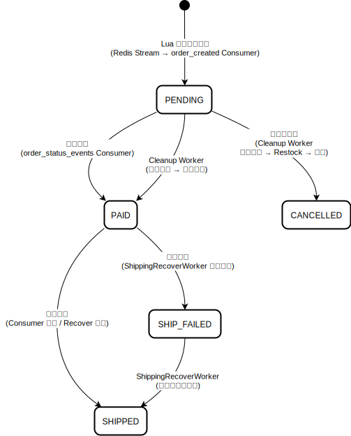

# 🛒 高并发电商交易系统架构设计

[](https://go.dev/)
[](https://redis.io/)
[](https://mysql.com/)
[](https://rocketmq.apache.org/)
[](https://kubernetes.io/)

> 基于 [Google Cloud Microservices Demo](https://github.com/GoogleCloudPlatform/microservices-demo) 重构的高可用电商微服务系统。
> 核心改造聚焦于 **下单 (Place Order)** 链路，实现高并发场景下的 **高性能 + 数据最终一致性 + 全链路容灾**。

---

## 📑 目录

- [系统概览](#系统概览)
- [核心架构](#核心架构)
- [技术栈](#技术栈)
- [项目结构](#项目结构)
- [核心流程](#核心流程)
  - [同步下单流程](#1-同步下单流程)
  - [异步 Worker 与补偿机制](#2-异步-worker-与补偿机制)
- [关键设计细节](#关键设计细节)
  - [数据一致性保障](#数据一致性保障)
  - [高性能优化](#高性能优化)
  - [容错与降级策略](#容错与降级策略)
- [订单状态机](#订单状态机)
- [可观测性](#可观测性)

---

## 系统概览

本系统是一个面向电商场景的微服务架构，核心设计目标：

| 目标 | 实现方式 |
|------|----------|
| **高性能** | Redis 缓存 + Lua 原子脚本，热路径避免数据库直连 |
| **数据一致性** | Redis Stream → MySQL 异步刷盘 + 幂等机制（最终一致性） |
| **高可用容灾** | 多层补偿机制，任意组件宕机后数据零丢失 |
| **服务解耦** | RocketMQ 消息驱动，服务间无直接 Redis 依赖 |

---

## 核心架构



---

## 技术栈

| 层次 | 技术 | 用途 |
|------|------|------|
| **语言** | Go 1.21+ | 全部后端服务 |
| **RPC框架** | gRPC + Protobuf | 服务间通信 |
| **缓存** | Redis 7.x (Sentinel 模式) | 库存缓存、Stream 消息通道 |
| **数据库** | MySQL 8.0 (GORM) | 持久化存储 |
| **消息队列** | Apache RocketMQ 5.x | 异步解耦、事件驱动 |
| **容器编排** | Kubernetes | 服务部署与管理 |
| **链路追踪** | OpenTelemetry + Jaeger | 分布式追踪 |
| **指标监控** | OpenTelemetry + Prometheus | 业务指标与系统指标 |
| **熔断器** | sony/gobreaker | Redis / RPC 熔断保护 |

---

## 项目结构

```
src/
├── checkoutservice/             # 结算服务 (下单入口)
│   └── main.go                  # PlaceOrder → 调用 OrderService
│
├── productcatalogservice/       # 商品目录服务 (库存核心)
│   ├── server.go                # gRPC Server + 初始化
│   ├── repository/
│   │   ├── cached_repo.go       # Redis 缓存层 + Lua 脚本 + Stream Worker (内嵌)
│   │   └── mysql_repo.go        # MySQL 基础数据层
│   ├── forwarder/
│   │   └── worker.go            # Redis Stream → RocketMQ 转发器
│   ├── model/
│   │   └── product.go           # 商品模型
│
├── orderservice/                # 订单服务
│   ├── main.go                  # 服务入口 + Worker 启动
│   ├── pkg/service/
│   │   └── service.go           # gRPC 业务逻辑 (CreateOrder, CancelOrder)
│   ├── pkg/repository/
│   │   └── order_repo.go        # MySQL 订单数据层 (批量操作)
│   ├── pkg/model/
│   │   ├── order.go             # 订单/发货模型 + 状态常量
│   │   └── failed_order.go      # 死信订单模型
│   ├── pkg/worker/
│   │   ├── consumer.go          # RocketMQ Consumer (订单创建 + 状态更新 + 发货)
│   │   ├── cleanup.go           # 超时订单清理 Worker
│   │   ├── shipping_recover.go  # 发货补偿 Worker
│   │   ├── dlq.go               # 死信队列监控 Consumer
│   │   ├── shipment_flusher.go  # 发货记录批量刷盘
│   │   └── stream.go            # Redis Stream Worker (备用)
│   └── pkg/client/
│       └── payment_client.go    # Payment 客户端 (熔断器 + 超时)
│
├── paymentservice/              # 支付服务
├── shippingservice/             # 物流服务
├── cartservice/                 # 购物车服务
├── currencyservice/             # 汇率服务
├── emailservice/                # 邮件服务
├── frontend/                    # Web 前端
└── ...
```

---

## 核心流程

### 1. 同步下单流程

用户发起下单请求后，系统通过 gRPC 协调各服务。核心库存扣减操作完全在 Redis 中通过 Lua 脚本原子执行，避免了数据库锁竞争，确保了极高的吞吐量。支付成功后立即返回响应，后续的订单落库与发货由异步链路接管。



### 2. 异步 Worker 与补偿机制

整个异步处理链路由多组 Worker 协同完成，每一层都有对应的补偿机制，保障任意环节宕机后数据不丢失。

#### 2.1 库存同步链路 (ProductCatalogService)

采用 **Write-Behind（写后）** 策略。`StockWorker` 周期性从 Redis Stream 批量拉取扣减记录（Batch Size: 200），在内存中聚合相同商品的扣减量，最终合并为一条 SQL 更新数据库。这种机制将数据库的写入压力降低了几个数量级。


#### 2.2 订单创建链路

为了解耦库存与订单服务，`OrderForwarder` 作为中继组件，负责将订单数据从 Redis Stream 可靠地投递到 RocketMQ。下游的 `OrderConsumer` 削峰填谷，批量将订单数据写入 MySQL，保障了流量高峰下的系统稳定性。


#### 2.3 发货与状态更新链路

基于 **事件驱动架构**。订单支付成功后发出 `PAID` 事件，触发消费者并发调用物流服务。若发货失败，系统会自动重试；若长时间未发货，`ShippingRecoverWorker` 会作为最终兜底机制介入，确保每一笔已付订单都能成功履约。


#### 2.4 死信队列处理

作为系统的最后一道防线。当消息经过多次重试仍无法消费时（如代码 Bug 或脏数据），会被路由至死信队列（DLQ）并持久化到数据库。这既防止了毒消息阻塞正常消费链路，也为后续的人工排查提供了现场数据。


---

## 关键设计细节

### 数据一致性保障

| 机制 | 实现 | 涉及代码 |
|------|------|----------|
| **库存扣减幂等** | Lua 脚本中 `dedupKey` 检查，`SETEX` TTL 1小时 | `cached_repo.go` `LuaDeductStock` |
| **库存回滚幂等** | Lua 脚本中 `rollbackKey` + `SETNX`，TTL 24小时 | `cached_repo.go` `LuaRestock` |
| **Stream 消费幂等** | MySQL `stock_dedup_log` 表记录已处理的 MsgID | `cached_repo.go` `flushBufferToMySQL` |
| **订单创建幂等** | MySQL 主键 `order_id` 唯一约束，捕获 1062 错误 | `consumer.go` `isDuplicateError` |
| **状态更新防回滚** | `WHERE status < ?` 条件更新，只允许状态正向流转 | `order_repo.go` `UpdateOrderStatus` |
| **Pending 消息补偿** | 定时扫描 + `XCLAIM` 夺取处理权，保障消息不丢失 | `cached_repo.go` `startPendingRecover` |

### 高性能优化

| 优化点 | 实现方式 |
|--------|----------|
| **Redis Lua 原子操作** | 库存检查 + 扣减 + Stream 写入在一次 EVALSHA 中完成，无网络往返 |
| **批量聚合刷盘** | Stock Worker 批量拉取 200 条消息，内存聚合后 `CASE WHEN` 一次 SQL 更新 |
| **批量订单插入** | `CreateInBatches(orders, 100)` 批量写入，失败降级为逐条插入 |
| **并发 RPC 限流** | `sem := make(chan struct{}, 10)` 信号量限制 Shipping RPC 并发度 |
| **SingleFlight 防击穿** | `singleflight.Group` 聚合相同 Key 的并发请求，避免缓存击穿 |
| **缓存随机 TTL** | `10min + rand(60s)` 防止缓存雪崩 |
| **批量状态更新** | `CASE order_id WHEN ? THEN IF(status < ?, ?, status)` 单 SQL 批量更新 |

### 容错与降级策略

| 场景 | 策略 |
|------|------|
| **Redis 不可用** | 熔断器 (gobreaker) 快速失败，避免雪崩 |
| **Redis 缓存 Miss** | SingleFlight + 回源 MySQL + SetNX 回写缓存 |
| **库存缓存未初始化** | 最多重试 3 次，每次从 MySQL 加载后重新执行 Lua 脚本 |
| **批量写入失败** | 降级为逐条写入，逐条失败则标记重试或进入 DLQ |
| **RocketMQ 发送失败** | 不 ACK Redis Stream 消息，由 Recovery Worker 周期性重试 |
| **支付 RPC 失败** | Payment Client 包装熔断器 + 3s 超时；失败返回 PENDING，由 Cleanup Worker 后续对账 |
| **发货 RPC 失败** | 返回 `ConsumeRetryLater`，MQ 自动重试；最终由 ShippingRecoverWorker 兜底 |
| **DLQ 发送失败** | 打印 CRITICAL 日志，返回 Success 防止卡死后续消费 |
| **Redis 连接失败** | 指数退避重试 (最多 10 次，上限 30s)，最终降级为纯 MySQL 模式 |

---

## 订单状态机



**状态值定义：**

| 值 | 状态 | 说明 |
|----|------|------|
| 0 | `PENDING` | 订单已创建，等待支付确认 |
| 1 | `PAID` | 支付成功，等待发货 |
| 2 | `CANCELLED` | 订单已取消（超时未付款） |
| 3 | `SHIPPED` | 已发货 |
| 4 | `SHIP_FAILED` | 发货失败（等待补偿重试） |

---

## 可观测性

本系统集成了基于 **OpenTelemetry** 的可观测性方案，覆盖 **Traces（链路追踪）** 和 **Metrics（指标监控）** 两个维度。

### 架构总览



### Traces（分布式链路追踪）

所有三个核心服务均已集成 **OpenTelemetry Tracing**，通过 OTLP gRPC 上报至 OTel Collector，再导出到 **Jaeger**。

| 服务 | 追踪覆盖 | 采样策略 | 特殊集成 |
|------|----------|----------|----------|
| **ProductCatalogService** | ✅ 完整 | `ParentBased(TraceIDRatio=0.1)` | Redis 自动埋点 (`redisotel`) + GORM 自动埋点 (`otelgorm`) |
| **OrderService** | ✅ 完整 | `ParentBased(TraceIDRatio=0.1)` | gRPC Client/Server 自动埋点 + GORM 自动埋点 (`otelgorm`) |
| **CheckoutService** | ✅ 完整 | `AlwaysSample` | gRPC Client/Server 自动埋点 |

**追踪链路示例：**
- `PlaceOrder` → `CreateOrder` → `ChargeProduct` (Lua 脚本) → Redis 操作均可在 Jaeger 中看到完整调用链
- ProductCatalogService 的 Redis 命令（GET/SET/EVALSHA/XADD）和 MySQL 查询均会自动生成 Span

### Metrics（业务指标监控）

所有三个核心服务均已集成完整的自定义业务指标。

#### 核心业务指标 (Business Metrics)

| 指标 | 类型 | 说明 | 来源 |
|------|------|------|------|
| `app_order_placed_total` | Counter | **下单总数** (Checkout Service 入口) | `checkoutservice` |
| `app_stock_charge_success_total` | Counter | **库存扣减成功数** (Redis 层面) | `productcatalogservice` |
| `app_shipping_success_total` | Counter | **发货成功数** (分 normal/retry 来源) | `orderservice` |
| `app_forwarder_lag_ms` | Gauge | **转发延迟** (Redis Stream → RocketMQ) | `productcatalogservice` |
| `repo_flush_success_total` | Gauge | **库存落库** (Async Worker 批量刷盘成功数) | `productcatalogservice` |

#### 技术亮点 (Traces)

1. **跨进程 Context 传播**:
   - `ProductCatalogService` 手动将 Trace Context 注入 Redis Stream Payload。
   - `OrderForwarder` 提取 Context 并透传至 RocketMQ UserProperties。

2. **批量链路关联 (Span Links)**:
   - `OrderConsumer` 在批量消费时，使用 `Span Links` 关联上游多个 Producer Span，完美解决 Batch 场景下的 Trace 断裂问题。

#### 指标数据流

```
服务 (OTel SDK) → OTLP gRPC → OTel Collector → Prometheus Exporter (:8889) → Prometheus (scrape 10s) → Grafana
```

### 可观测性部署

系统在 Kubernetes 中通过 `monitoring.yml` 部署以下组件：

| 组件 | 镜像 | 端口 | 用途 |
|------|------|------|------|
| **OTel Collector** | `otel/opentelemetry-collector-contrib:0.88.0` | 4317 (gRPC), 8889 (Prometheus) | 接收 OTLP 数据，导出到 Jaeger + Prometheus |
| **Jaeger** | `jaegertracing/all-in-one:latest` | 16686 (UI), 4317 (OTLP) | 链路追踪查询与可视化 |
| **Prometheus** | `prom/prometheus:v2.47.0` | 9090 | 指标采集与存储 |

---

## License

本项目基于 [Apache License 2.0](LICENSE) 发布。
